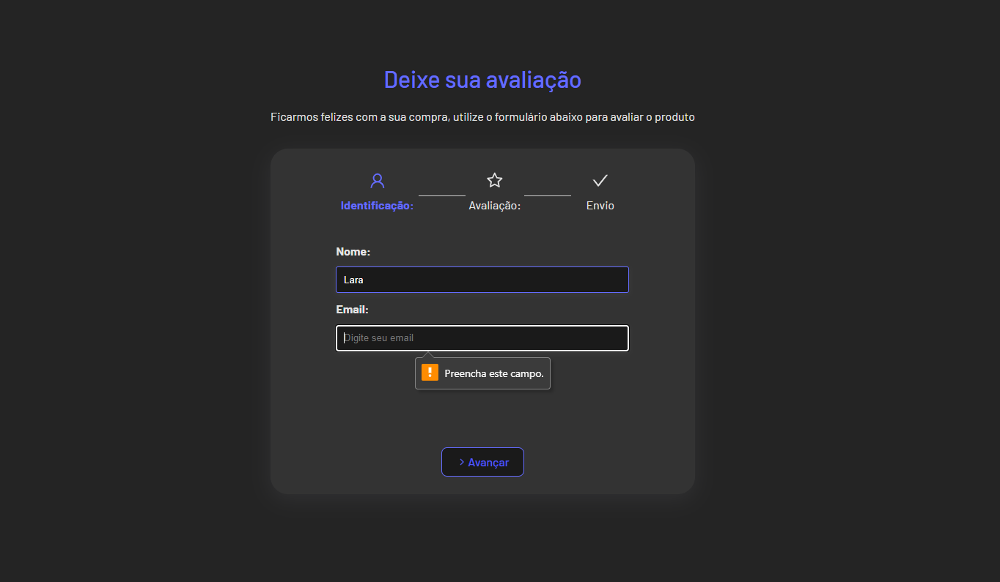
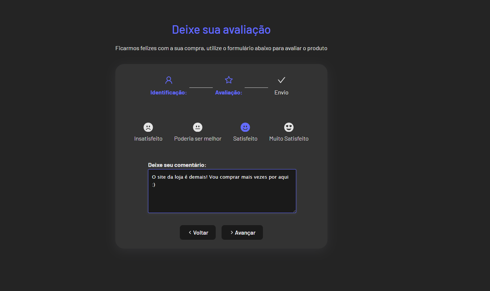

<h1 align="center"> Imc Calculator</h1>

Its a Java Scrpit pure project, that calculates any IMC person.  

  <a href="#-tecnologias">Techs/Tecnologias</a>&nbsp;&nbsp;&nbsp;|&nbsp;&nbsp;&nbsp;
  <a href="#-projeto">Project/Projeto</a>&nbsp;&nbsp;&nbsp;|&nbsp;&nbsp;&nbsp;
  <a href="#-layout">Layout</a>&nbsp;&nbsp;&nbsp;|&nbsp;&nbsp;&nbsp;
  <a href="#memo-licença">License/Licença</a>

  

  

  

  

## 🚀 Techs / Tecnologias

Esse projeto foi desenvolvido com as seguintes tecnologias:

- HTML e CSS
- JavaScript
- React Js
- React Icons
- Git e Github

## 💻 Project / Projeto

Uma página muito utilizada por sites de e-commerce, varejo e mercados. Esse formulário com react permite que os clientes que compraram nas lojas utilizem o formulário para deixar uma availiação e até mesmo um comentário, podendo visualizar antes de realizar o envio. 

A page widely used by e-commerce, retail and marketplace sites. This react form allows customers waiting in stores to use the form to leave availability and even a comment, which they can view before sending.

## 🔖 Layout

Você pode visualizar o layout do projeto através do repositório. 

Feito com amor por Lara.
Made w/ love by Lara.